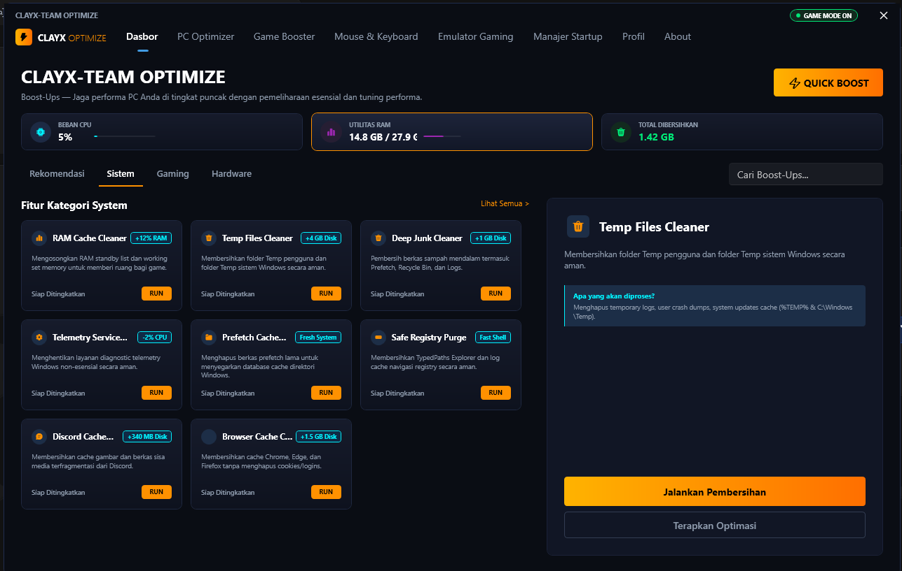
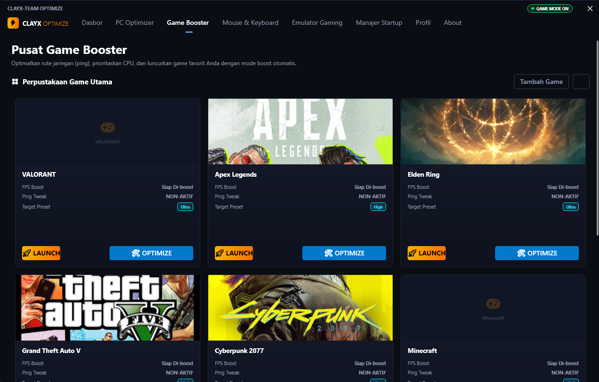
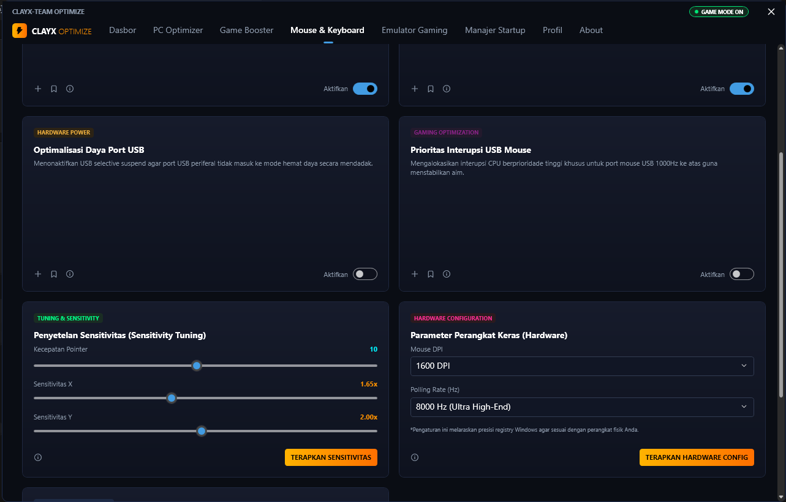
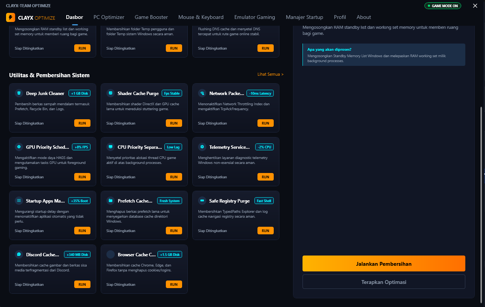
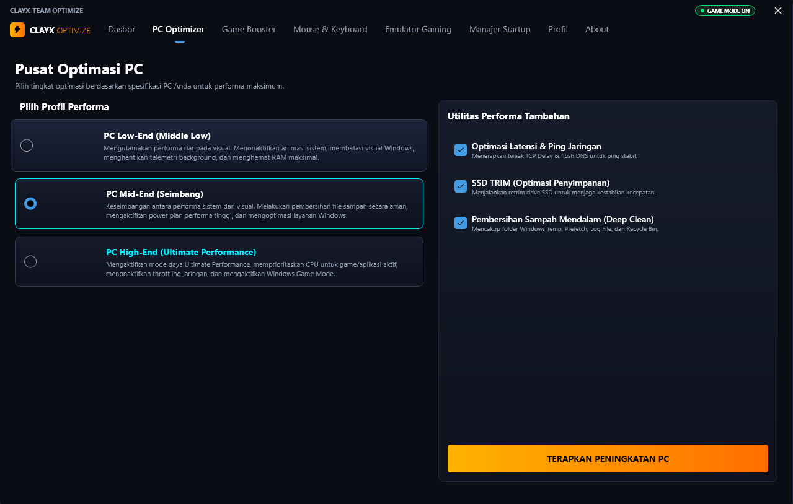

<h1 align="center">⚡ CLAYX OPTIMIZE</h1>

<h3 align="center">
Advanced Windows Optimization & Gaming Performance Utility
</h3>

<p align="center">
A powerful desktop application built with <b>C#</b>, <b>.NET</b>, and <b>WPF</b> to optimize Windows performance, reduce latency, clean system junk, and enhance gaming experience.
</p>

<p align="center">


</p>

---

# 🚀 Features

CLAYX OPTIMIZE provides a collection of performance enhancement tools designed for gamers and power users.

## 🖥️ PC Optimization Center

### Performance Profiles

Choose optimization settings based on your hardware specification:

- **Low-End Mode**
  - RAM optimization
  - Disable unnecessary visual effects
  - Background service reduction

- **Mid-End Mode**
  - Balanced performance configuration
  - Safe system cleanup
  - Windows service tuning

- **High-End Mode**
  - Ultimate Performance power plan
  - CPU priority optimization
  - Network throttling removal

### Additional Optimization Tools

- SSD TRIM Optimization
- Network Latency Reduction
- Deep System Cleanup
- Registry Performance Tweaks

---

## 🧹 System Cleaning Utilities

### RAM Cleaner
Free standby memory and reduce RAM usage before gaming.

### Deep Junk Cleaner
Clean:

- Temp Files
- Prefetch Files
- Windows Logs
- Cache Files
- Recycle Bin

### Shader Cache Cleaner
Remove outdated DirectX and GPU shader cache to reduce stuttering.

### Additional Tweaks

- GPU Hardware Scheduling
- Startup Applications Optimizer
- Telemetry Disabler
- Browser Cache Cleaner
- Discord Cache Cleaner

---

## 🖱️ Mouse & Keyboard Optimization

### USB Power Management

Prevent Windows from disabling USB devices to save power.

### Input Priority Optimization

- Mouse Interrupt Priority
- USB Response Optimization
- Polling Rate Configuration

### Precision Tuning

- Mouse Sensitivity Alignment
- Registry Optimization
- DPI Synchronization
- High Polling Rate Support

---

## 🎮 Gaming Booster

### Game Library

Manage installed games and launch them directly.

Supported Examples:

- Valorant
- Apex Legends
- GTA V
- Elden Ring
- Cyberpunk 2077

### One Click Boost

Automatically applies:

- Memory Optimization
- CPU Priority Tweaks
- Network Optimization
- Performance Configuration

Before launching games.

---

# 📸 Application Preview

## Dashboard

<p align="center">

</p>

<p align="center">
Main dashboard with system monitoring and optimization controls.
</p>

---

## PC Optimization Center

<p align="center">

</p>

<p align="center">
Performance profiles and hardware-based optimization settings.
</p>

---

## Gaming Booster Hub

<p align="center">

</p>

<p align="center">
Game launcher and performance boosting center.
</p>

---

## Mouse & Keyboard Tuning

<p align="center">

</p>

<p align="center">
Advanced input device optimization and tuning.
</p>

---

## Complete Tools Collection

<p align="center">

</p>

<p align="center">
Collection of all optimization modules available in CLAYX OPTIMIZE.
</p>

---

# 🏗️ Project Structure

```text
CLAYX-OPTIMIZE/
│
├── Models/
├── Services/
├── Styles/
├── Views/
├── Assets/
├── App.xaml
└── MainWindow.xaml
```

## Main Directories

### Models

Contains application models and configuration objects.

### Services

Contains:

- Registry Tweaks
- File Cleaning
- Memory Management
- Hardware Optimization Logic

### Styles

WPF Resource Dictionaries:

- Themes
- Colors
- Animations
- Controls

### Views

UI pages and navigation components.

---

# 💻 Getting Started

## Requirements

- Windows 10 / Windows 11
- Visual Studio 2022 Community or newer
- .NET Desktop Development Workload

---

## Clone Repository

```bash
git clone https://github.com/RIZZxPY77/EXTREME-ANDROID.git
```

## Open Project

Open:

```text
PCOptimizer.sln
```

or

```text
PCOptimizer.csproj
```

using Visual Studio.

---

## Restore Dependencies

Inside Visual Studio:

```text
Right Click Solution
→ Restore NuGet Packages
```

---

## Build & Run

Select:

```text
Debug
```

or

```text
Release
```

Then press:

```text
F5
```

to build and launch the application.

---

# 🛠️ Built With

- C#
- .NET
- WPF
- XAML
- Visual Studio

---

# 👨‍💻 Developer

```yaml
Developer: XRIZZ.PY777
GitHub: @RIZZxPY77
Primary Language: C#
Focus:
  - Windows Optimization
  - System Automation
  - Desktop Applications
  - UI/UX Development
```

---

<p align="center">
Made with ❤️ using C#, .NET and WPF
</p>
